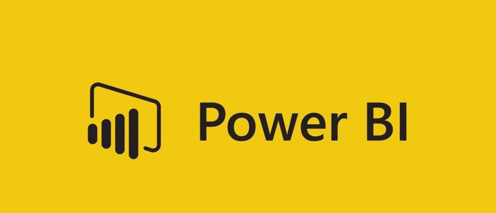
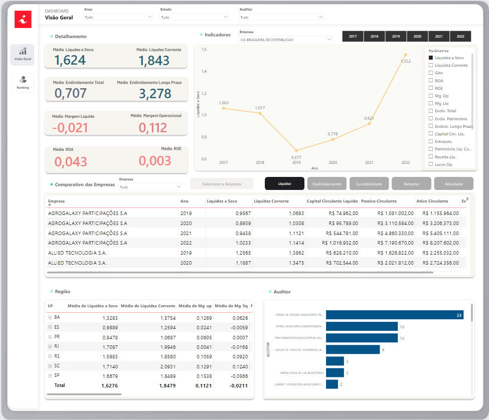
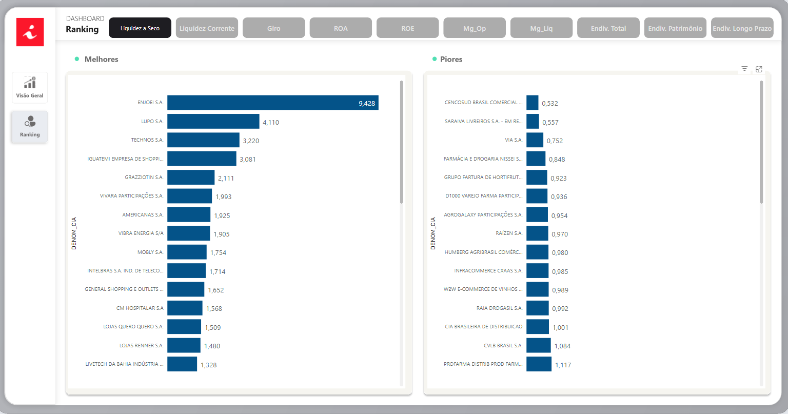
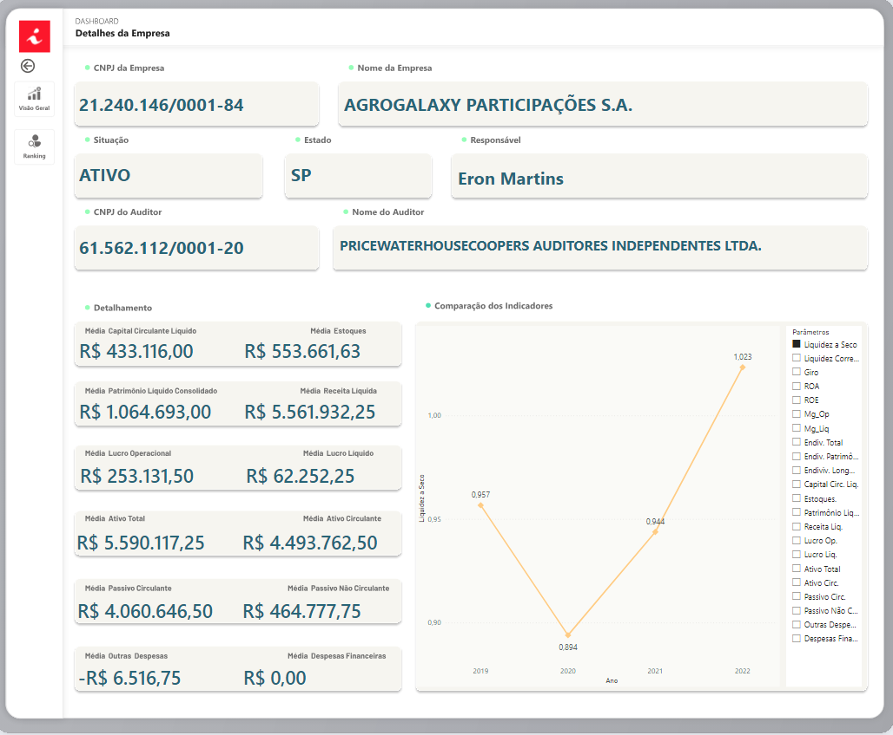

<h1 align="center">
    
</h1>

 <a href="#-como-executar-o-projeto">Como executar</a> •
 <a href="#-sobre-o-projeto">Sobre</a> •
 <a href="#-layout">Layout</a> 

## 🚀 Como executar o projeto

### Power BI Online:
Clique [AQUI](https://app.powerbi.com/view?r=eyJrIjoiMmRjMDMxYTItMDgxNy00N2Q3LWJjMTAtZWM0N2EyODg0NDkxIiwidCI6IjliYWY5MmM5LTJlNDgtNGRmZi05NTQ3LTdjNmJhNzhkZTlhNiJ9) para acessar o relatório online

## 💻 Sobre o projeto

#### Clique [AQUI](https://www.canva.com/design/DAFvlUCWy5I/XBSM4jMk4qCU7XONwDHyPg/edit) para acessar a apresentação Canvas
#### Clique [AQUI](https://www.figma.com/file/Rdz7kR3iDQkwgQOYUkZo0S/GIC?type=design&node-id=0-1&mode=design) para acessar o link do FIGMA

## ⚙️ Funcionalidades

- [x] Usuário acessa a Aplicação WEB, podendo visualizar
  - [x]
  - [x] 
  - [x] 
  - [x] 

---

## 🎨 Layout

O layout da aplicação está disponível no Figma:

### Web

  
  
  

